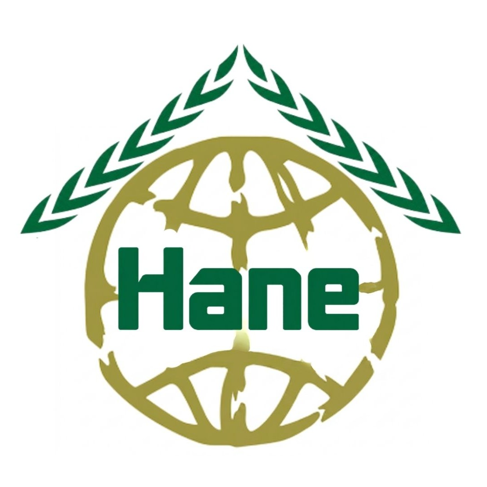
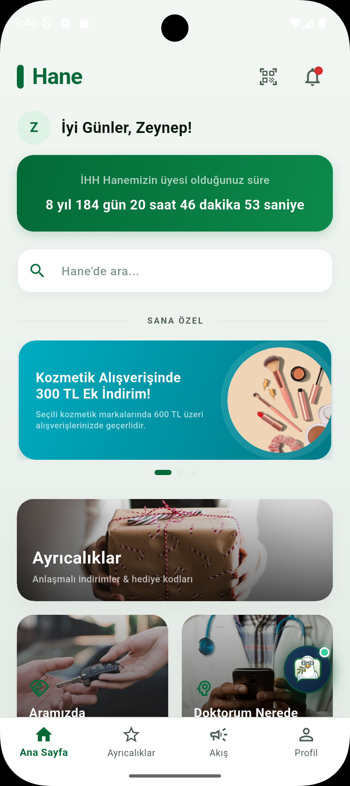
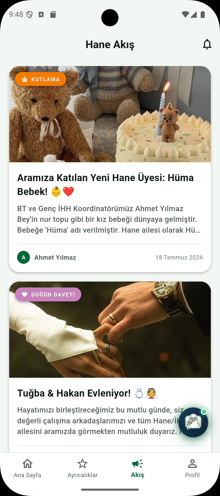
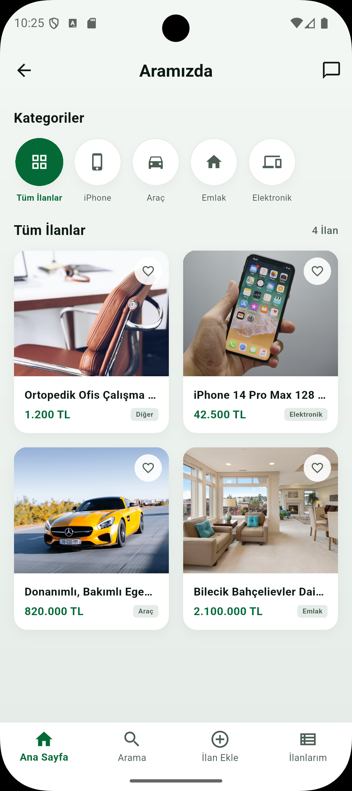

# <p align="center"><br>Hane</p>

<p align="center">
  
  
  
  
  
</p>

**Hane**, İHH İnsani Yardım Vakfı çalışanları ve gönüllüleri için özel olarak geliştirilmiş; insan kaynakları süreçlerini, esenlik (well-being) hizmetlerini, kurum içi yardımlaşmayı ve afet koordinasyonunu tek bir çatıda birleştiren **Yapay Zeka Destekli Kurumsal İntranet ve Toplumsal Fayda Mobil/Web Platformu**'dur.

---

## 🏆 Hackathon Başarısı ve Ödül Bilgisi

**Hane** projesi, **16-19 Temmuz 2026** tarihleri arasında Bursa AKOM'da düzenlenen, Üniversite-Hanımlar ve ATOM (İHH Teknoloji Geliştirme Topluluğu) ortaklığındaki **"Kampta Bir'iz 2026 - ATOM Yapay Zeka Odaklı Toplumsal Fayda Hackathon'u"** kapsamında jüri değerlendirmesi sonucu **2.lik Ödülü**'ne layık görülmüştür. 

*Sosyal fayda odaklı yapay zeka entegrasyonu, kapsamlı İK iş akışları ve responsive (mobil & web) yönetici paneli ile yüksek beğeni toplamıştır.*

---

## 🚀 Temel Modüller ve Özellikler

### 🤖 1. Hane AI Agent (Gemini 3.5 Flash Gücüyle)
Sistemde doğrudan **Gemini 3.5 Flash** REST API entegrasyonu (SDK-bağımsız mTLS bağlantısı) ile çalışan kurumsal yapay zeka asistanı yer almaktadır.
*   **İK ve Süreç Danışmanlığı:** Personelin sesli/yazılı sorularına yanıt vererek maaş bordrosu sorgulama, kalan izin günlerini öğrenme veya sağlık randevusu ayarlama süreçlerinde yardımcı olur.
*   **Rol Tabanlı Erişim Kontrolü (RBAC):** KVKK ve kurumsal güvenlik kurallarına uygun olarak hassas bilgileri (bordro, kişisel veri vb.) yalnızca yetkili rollere (Yönetici, Personel, Mali İşler) sunar.
*   **Karar Destek Sistemi (KDS):**
    *   **Saha Tükenmişlik Analizi:** Konuşma esnasında personelden gelen yorgunluk ve stres içerikli kelimeleri (*"tükendim"*, *"saha çok zordu"*, *"uyuyamadım"*) arka planda analiz ederek risk durumunu belirler ve İK paneline otomatik olarak *"Kurum Psikoloğu Randevu Önerisi"* iletir.
    *   **Dinamik Yetenek Haritalama:** Çalışanın kazandığı sertifikaları veya tamamladığı eğitimleri konuşma akışından yakalayarak İK Onay Paneline profil güncelleme talebi olarak gönderir.

### 🏥 2. Doktorum Nerede & Sağlık Randevuları
Çalışanların fiziksel ve zihinsel sağlıklarını korumayı amaçlayan entegre randevu modülü:
*   **İş Yeri Hekimi:** Salı ve Perşembe günleri 10:00 - 15:00 arası için dinamik randevu planlama.
*   **Kurum Psikoloğu:** Pazartesi ve Çarşamba günleri 09:00 - 17:00 arası için esenlik seansları kaydı.

### 🩸 3. KanKardeşim (Acil Kan Havuzu)
Toplumsal yardımlaşmayı ve kurum içi dayanışmayı en üst seviyeye taşıyan P2P kan bağışı koordinasyon portalı:
*   **Akıllı Eşleşme:** Bir personel acil kan talebi oluşturduğunda sistem, talep edilen kan grubuna ve konuma sahip diğer personele akıllı push bildirimi gönderir.
*   **Catalyst Teşvik Sistemi (+1 Gün İzin):** Kan bağışı belgesini sisteme yükleyen personele sistem üzerinden otomatik olarak **+1 gün idari izin** tanımlanır.

### 🤝 4. Aramızda (İkinci El Pazarı)
İHH personelinin kendi aralarında güvenli alışveriş yapabilmesi için tasarlanmış C2C ilan pazarı. Tayin, saha görevi veya ihtiyaç fazlası durumlarında eşyaların kurum içinde hızlıca değerlendirilmesini sağlar.

### 🚨 5. Afet Koordinasyonu & İSG Acil Butonu
Sahadaki personelin can güvenliğini izlemek için geliştirilmiş kriz yönetim aracı. Acil durumlarda personelin tek tuşla konumuyla birlikte durum bildirmesini (*"Güvendeyim"* / *"Desteğe İhtiyacım Var"*) ve İK koordinatör paneline GPS verisi iletilmesini sağlar.

### 🖥️ 6. Responsive İK Yönetici Paneli
Platformun mobil cihazlarda çalışmasının yanı sıra, İK uzmanları için geliştirilen yönetici paneli geniş ekranlar (Web/Tablet/Masaüstü) için tamamen responsive tasarlanmıştır:
*   **Paylaşım Onayları:** Kurum içi akışta yayınlanacak duyuruların ve ilanların editöryal kontrolü.
*   **CRM & Çalışan Analitiği:** Çalışanların sağlık profilleri, kronik hastalık riskleri ve yapay zekanın tespit ettiği saha tükenmişlik oranlarının takibi.
*   **Bordro ve İzin Yönetimi:** Maaş bordrolarının yüklenmesi ve izin taleplerinin onay/ret süreçleri.
*   **Sistem Logları:** Güvenlik ve veri denetimi için tüm kullanıcı işlemlerinin anlık log dökümü.

---

## 📸 Ekran Görüntüleri (Screenshots)

### 📱 Mobil Uygulama Arayüzü

<p align="center">
  
  
  
</p>

<p align="center">
  <i>Hane Mobil: Ana Sayfa (Katılım Zamanlayıcısı), Hane AI Kurumsal Asistan ve Sağlık Randevu Sistemi</i>
</p>

---

## 🛠️ Teknolojik Altyapı ve Kütüphaneler

*   **UI Framework:** [Flutter (Dart SDK ^3.10.7)](https://flutter.dev/) - Çapraz platform mobil ve web arayüzü.
*   **Backend & DB:** [Firebase Core](https://firebase.google.com/) & [Firebase Database](https://firebase.google.com/docs/database) - Gerçek zamanlı veri senkronizasyonu ve kullanıcı yönetimi.
*   **Yapay Zeka (LLM):** [Google Generative AI](https://ai.google.dev/) (**Gemini 3.5 Flash**) - Sistem yönlendirmeleriyle sınırlandırılmış güvenli kurumsal asistan motoru.
*   **Tasarım Dili:** Özel HSL renk paleti (Sage yeşili ve koyu yeşil tonlar), **DINPro** ve **Quicksand** premium tipografi ailesi ile modern ve göz yormayan kart arayüzleri.
*   **Yardımcı Paketler:** `shared_preferences` (Yerel hafıza), `uuid` (Benzersiz kimlikler), `http` (Gemini API HTTP İstekleri), `flutter_svg` (Vektörel çizimler).

---

## 💻 Kurulum ve Çalıştırma

### Gereksinimler
*   Flutter SDK (3.10.0 veya üzeri)
*   Dart SDK (3.0.0 veya üzeri)
*   Firebase Projesi (Firebase Database aktif olmalı)

### Adımlar

1.  **Projeyi Klonlayın:**
    ```bash
    git clone https://github.com/zeynepttr/Teksas.git
    cd Hane
    ```

2.  **Bağımlılıkları Yükleyin:**
    ```bash
    flutter pub get
    ```

3.  **Yapay Zeka API Anahtarını Tanımlayın:**
    `lib/screens/hane_agent_screen.dart` dosyasındaki `_apiKey` alanına Gemini API anahtarınızı girin:
    ```dart
    static const String _apiKey = 'API_KEYINIZ_BURAYA';
    ```

4.  **Firebase Yapılandırmasını Ekleyin:**
    Firebase kurulumu için `lib/firebase_options.dart` dosyasını kendi Firebase projenizin ayarlarıyla güncelleyin.

5.  **Uygulamayı Çalıştırın:**
    ```bash
    # Mobil cihaz veya emülatörde çalıştırmak için
    flutter run
    
    # Web platformunda test etmek için
    flutter run -d chrome
    ```

---

## 🔒 KVKK ve Güvenlik Protokolleri

1.  **Uçtan Uca mTLS Entegrasyonu:** Gemini API ve Firebase bağlantıları IP Whitelisting ve şifrelenmiş geçit kanalları üzerinden yürütülür.
2.  **Rol Tabanlı Kısıtlama:** Çalışanların sicil numarası, İK durumu ve maaş dökümleri şifreli veritabanında tutulur ve yapay zeka dahi olsa yetkisiz kimselerle paylaşılmaz.
3.  **Çift Aşamalı Doğrulama:** Bordro gibi finansal dökümlere erişilmeden önce çalışanın kurumsal e-postasına OTP veya 4 haneli PIN sorgusu gönderilir.

---

## 👥 Proje Sahipleri

*   **Zeynep Kapsız**
*   **Tuğba Cin**
*   **Zeynep Tatar**

---

<p align="center">
  <i>Hane, İHH çalışanlarının gücüne güç katmak ve toplumsal faydayı teknolojiyle birleştirmek için geliştirilmeye devam ediyor. 💚</i>
</p>
